# NoShow AI — Appointment No-Show Prediction

A machine learning-powered Streamlit application that predicts the likelihood of
appointment no-shows for service-based organizations (clinics, salons, repair
centers, consulting firms, and similar businesses). Built around the workflow
described in *"A Generalized Machine Learning Framework for Appointment No-Show
Prediction in Service-Based Organizations."*

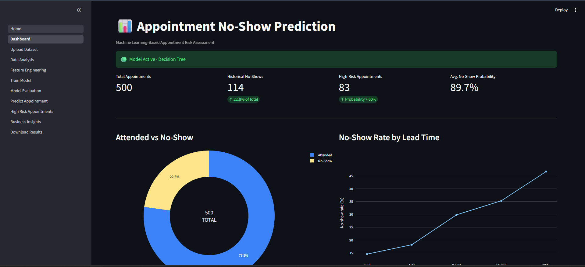
<!-- TODO: replace with a real screenshot of the Dashboard page -->

## Installation
```bash
git clone https://github.com/SifanShamlewala/NoshowAI
cd noshow_app

python3 -m venv .venv
.venv\Scripts\activate

pip install -r requirements.txt
```

## Usage

```bash
streamlit run Home.py
```


---

## Table of Contents

- [Overview](#overview)
- [Features](#features)
- [Screenshots](#screenshots)
- [Architecture](#architecture)
- [Project Structure](#project-structure)
- [Tech Stack](#tech-stack)
- [Installation](#installation)
- [Usage](#usage)
- [Required CSV Columns](#required-csv-columns)
- [How the App Flow Works](#how-the-app-flow-works)
- [Model Details](#model-details)
- [Configuration Notes](#configuration-notes)
- [Roadmap](#roadmap)
- [License](#license)

---

## Overview

Missed appointments cost service organizations unused capacity, scheduling
inefficiencies, and lost revenue. This project trains a supervised classification
model on historical appointment data to score each appointment with a **no-show
probability**, classify it into a **risk level** (Low / Medium / High), and surface
actionable insights so staff can proactively confirm high-risk bookings.

The framework is domain-independent — the same pipeline works for dental clinics,
salons, auto repair shops, consultants, or any appointment-driven business, as long
as the historical data follows the expected schema.

## Features

- 📤 CSV upload with schema validation, cleaning, and automatic feature engineering
- 📊 Interactive dashboard with key metrics and attendance trends
- 📈 Exploratory data analysis (no-show rate by service, time, day, lead time, reminders)
- 🧪 Transparent feature engineering step (lead time, day of week, attendance history, etc.)
- 🤖 Train and compare multiple classification algorithms (Logistic Regression, Decision
  Tree, Random Forest, Gradient Boosting)
- 📐 Model evaluation with accuracy, precision, recall, F1, ROC-AUC, confusion matrix,
  and full classification report
- 🔮 Single-appointment prediction form with risk badge and suggested action
- 🚨 Batch scoring of all appointments with an adjustable risk threshold
- 💡 Business insights (riskiest services, time slots, behavior correlations)
- ⬇️ CSV export of predictions and summary reports

## Screenshots


### Home Page
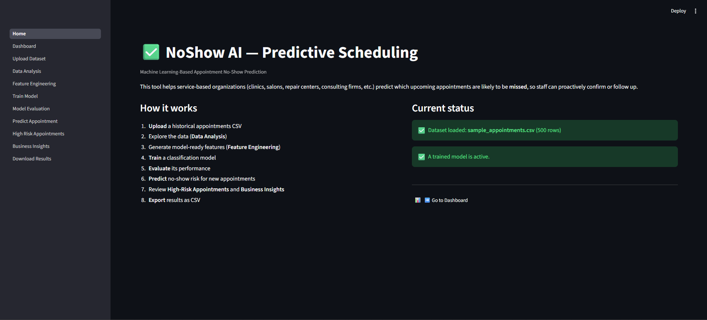
<!-- TODO: screenshot of Home.py -->

### Dashboard
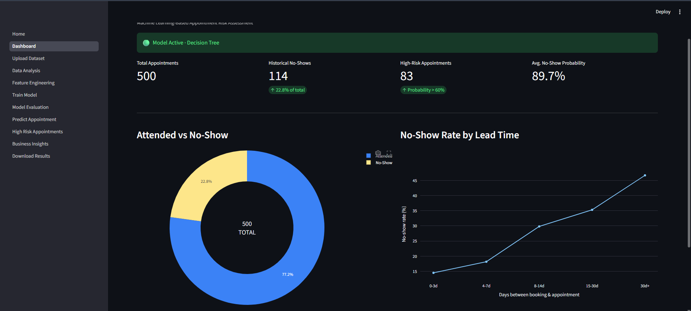
<!-- TODO: screenshot of pages/1_Dashboard.py with an active dataset loaded -->

### Upload Dataset
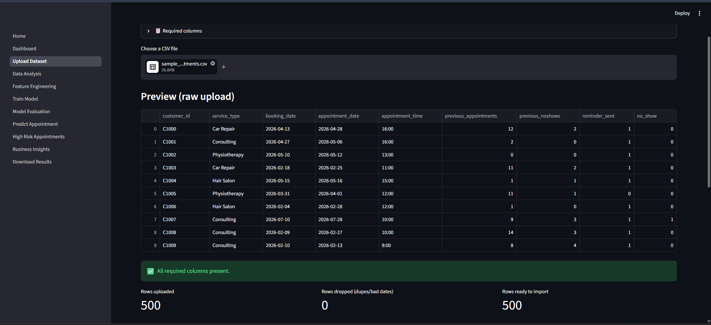
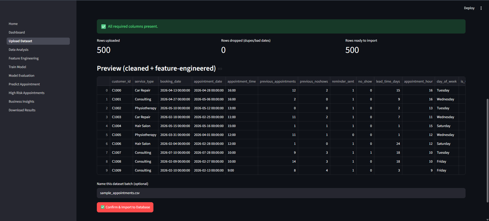
<!-- TODO: screenshot of pages/2_Upload_Dataset.py mid-upload, showing validation preview -->

### Data Analysis (EDA)
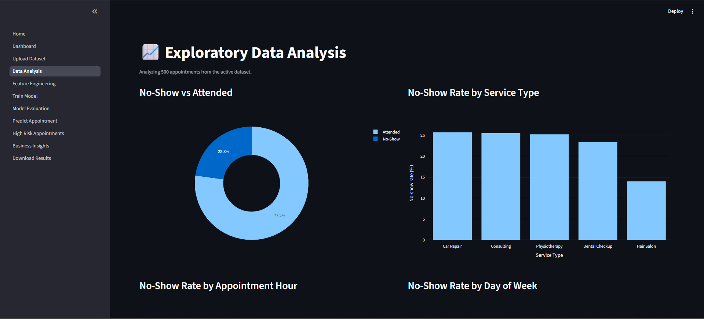
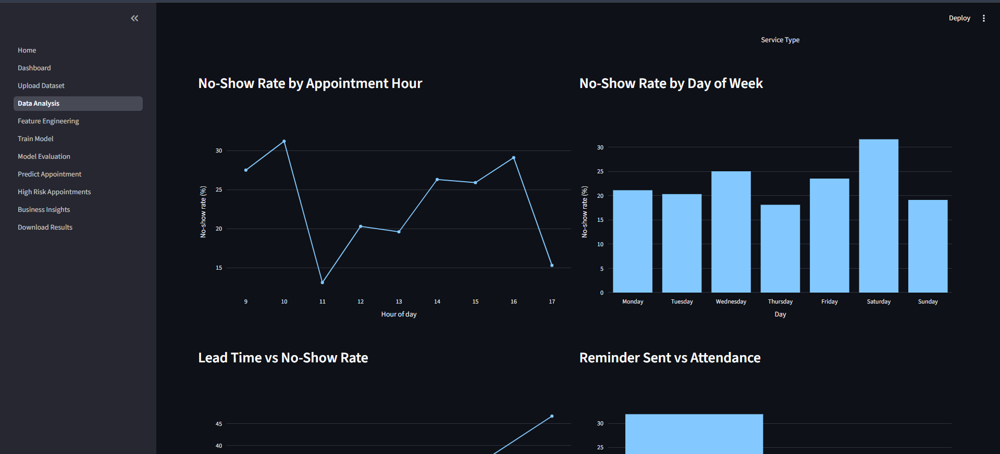
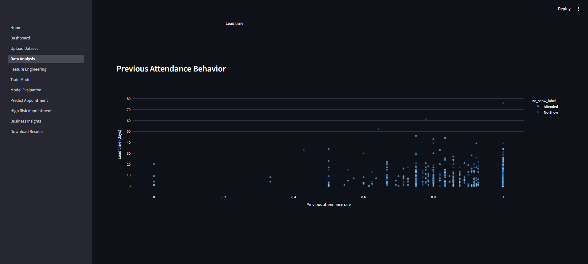
<!-- TODO: screenshot of pages/3_Data_Analysis.py charts -->

### Feature Engineering
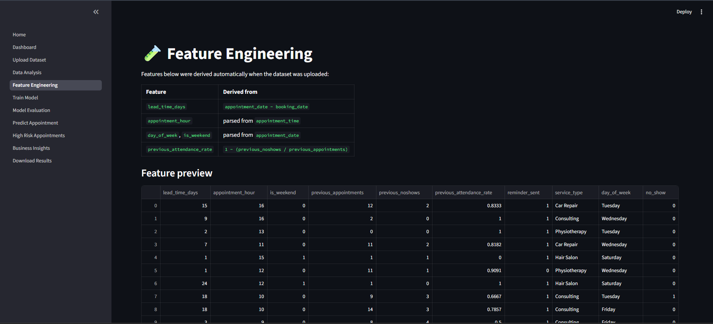
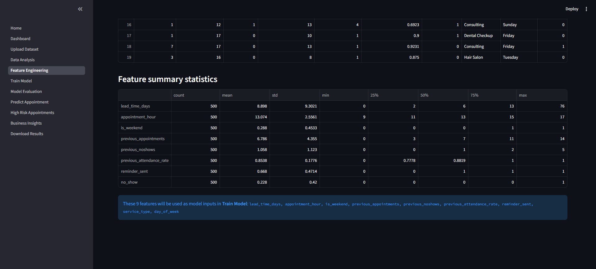
<!-- TODO: screenshot of pages/4_Feature_Engineering.py table -->

### Train Model
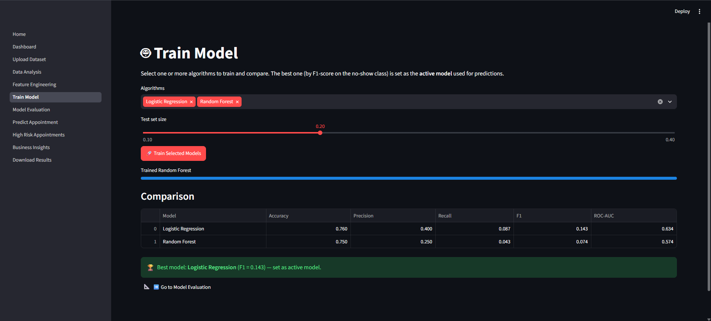
<!-- TODO: screenshot of pages/5_Train_Model.py comparison table -->

### Model Evaluation
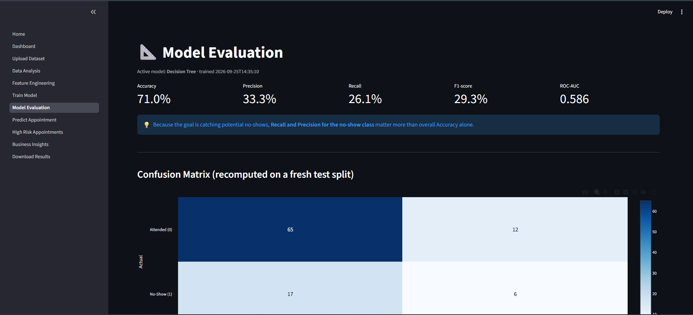
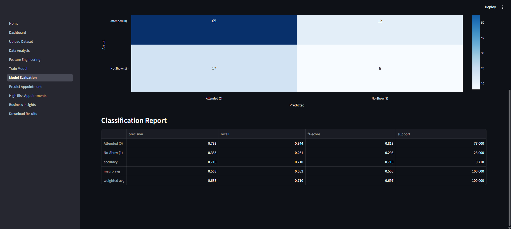
<!-- TODO: screenshot of pages/6_Model_Evaluation.py confusion matrix + classification report -->

### Predict Appointment
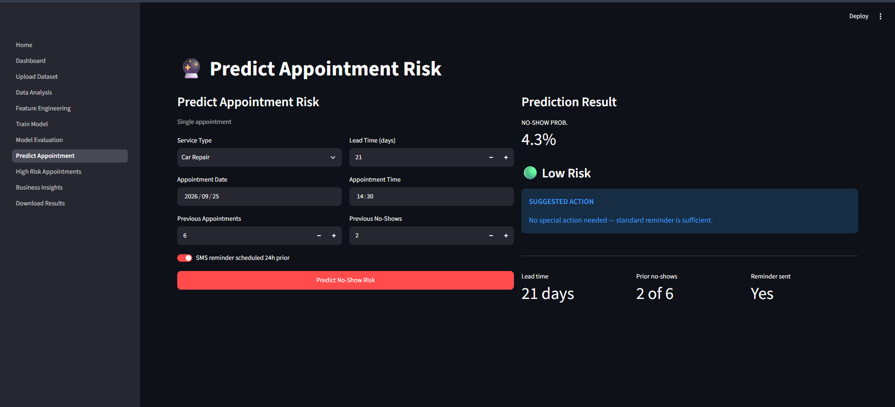
<!-- TODO: screenshot of pages/7_Predict_Appointment.py showing a filled form + result -->

### High-Risk Appointments
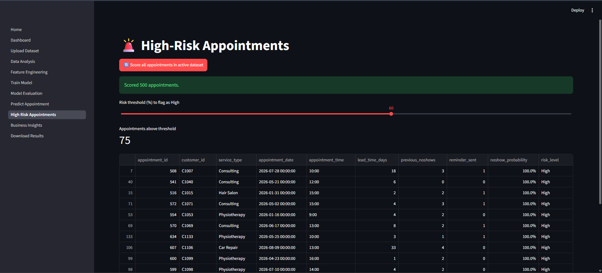
<!-- TODO: screenshot of pages/8_High_Risk_Appointments.py scored table -->

### Business Insights
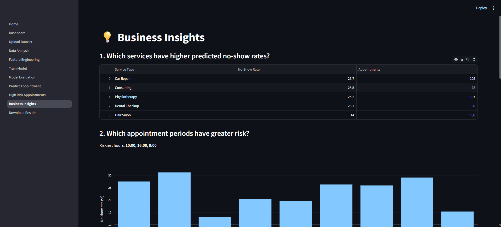
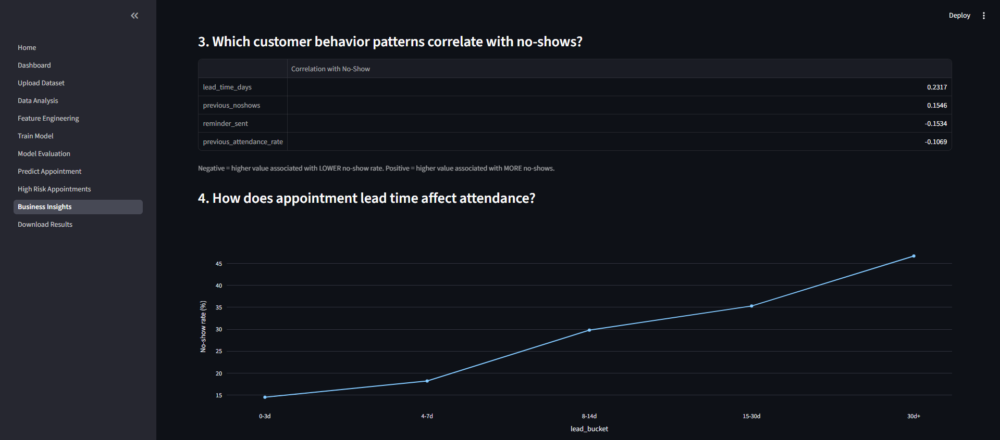
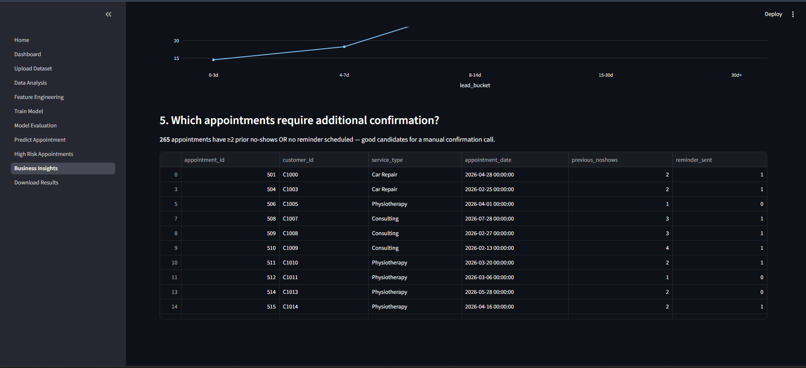
<!-- TODO: screenshot of pages/9_Business_Insights.py -->

### Download Results
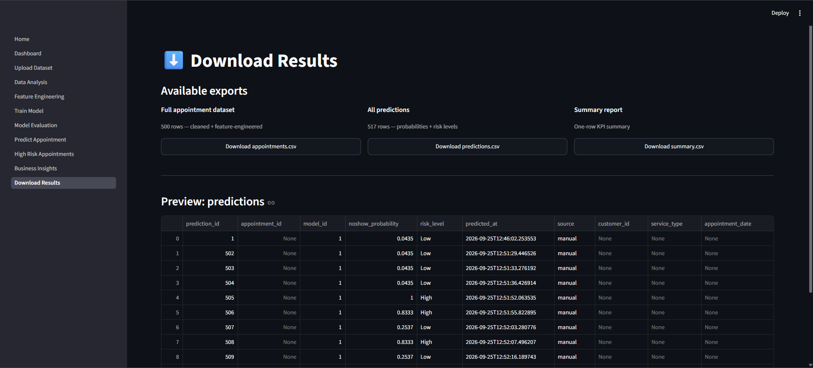
<!-- TODO: screenshot of pages/10_Download_Results.py -->

## Architecture

```
Historical Appointment Data
        ↓
   Data Validation
        ↓
  Data Preprocessing
        ↓
 Feature Engineering
        ↓
Exploratory Data Analysis
        ↓
   Model Training
        ↓
Model Evaluation & Selection
        ↓
No-Show Probability Prediction
        ↓
   Risk Classification
        ↓
  Streamlit Dashboard
        ↓
Business Insights & Export
```

Every page after **Upload Dataset** checks whether an active dataset (and, where
needed, a trained model) exists before rendering. If not, the user is redirected
with a clear "upload data first" / "train a model first" prompt.

## Project Structure

```
noshow_app/
├── Home.py                          # Landing page, initializes the SQLite DB
├── pages/
│   ├── 1_Dashboard.py               # KPIs + charts (gated on dataset)
│   ├── 2_Upload_Dataset.py          # Validate → clean → engineer → store
│   ├── 3_Data_Analysis.py           # EDA charts (gated on dataset)
│   ├── 4_Feature_Engineering.py     # Shows derived features (gated on dataset)
│   ├── 5_Train_Model.py             # Train & compare models (gated on dataset)
│   ├── 6_Model_Evaluation.py        # Metrics, confusion matrix, report (gated on model)
│   ├── 7_Predict_Appointment.py     # Single-appointment prediction form (gated on model)
│   ├── 8_High_Risk_Appointments.py  # Batch scoring + table (gated on model)
│   ├── 9_Business_Insights.py       # Aggregated insights (gated on dataset)
│   └── 10_Download_Results.py       # CSV exports (gated on dataset)
├── utils/
│   ├── db.py                        # SQLite schema + connection helper
│   ├── state.py                     # require_data() / require_model() gating logic
│   └── features.py                  # CSV validation, cleaning, feature engineering
├── data/                            # noshow.db lives here (auto-created)
├── models/                          # Trained model .joblib files
├── sample_data/
│   └── sample_appointments.csv      # Synthetic dataset for testing the full flow
├── docs/
│   └── screenshots/                 # Place README screenshots here
├── requirements.txt
└── README.md
```

## Tech Stack

| Layer               | Technology                          |
|---------------------|--------------------------------------|
| Frontend/App        | Streamlit                            |
| Language            | Python 3.10+                         |
| Machine Learning    | scikit-learn                         |
| Data Handling       | Pandas, NumPy                        |
| Visualization       | Plotly                               |
| Data Storage        | SQLite                               |
| Model Persistence   | Joblib                               |


### Try it end-to-end with the sample dataset

1. Go to **Upload Dataset**, upload `sample_data/sample_appointments.csv`, and click
   **Confirm & Import to Database**.
2. Visit **Dashboard** — KPIs and charts populate automatically.
3. Explore **Data Analysis** and **Feature Engineering**.
4. Go to **Train Model**, select one or more algorithms, and click **Train Selected
   Models**. The best-performing model becomes active.
5. Check **Model Evaluation** for detailed metrics.
6. Use **Predict Appointment** to score a single new appointment.
7. Use **High-Risk Appointments** to batch-score the whole dataset.
8. Review **Business Insights** for aggregated findings.
9. Export results from **Download Results**.

## Required CSV Columns

Your uploaded historical appointments CSV must contain:

```
customer_id, service_type, booking_date, appointment_date, appointment_time,
previous_appointments, previous_noshows, reminder_sent, no_show
```

Notes:
- `booking_date` / `appointment_date`: any standard date format (e.g. `2026-09-01`)
- `appointment_time`: `14:30` or `2:30 PM` style formats are accepted
- `reminder_sent` / `no_show`: `0`/`1`, `Yes`/`No`, or `True`/`False`
- `previous_appointments` / `previous_noshows`: integers

The following features are derived automatically — do **not** include them in your
upload:

- `lead_time_days` — days between `booking_date` and `appointment_date`
- `appointment_hour`, `day_of_week`, `is_weekend` — parsed from date/time fields
- `previous_attendance_rate` — `1 − (previous_noshows / previous_appointments)`

## How the App Flow Works

- **Home** is always accessible and initializes the database on first load.
- **Upload Dataset** is the only unrestricted "write" page. Uploading a new CSV
  deactivates any previous dataset and makes the new one active.
- **Dashboard**, **Data Analysis**, **Feature Engineering**, **Business Insights**,
  and **Download Results** require an active dataset — if none exists, the page
  shows a prompt to upload one first.
- **Train Model**, **Model Evaluation**, **Predict Appointment**, and **High-Risk
  Appointments** additionally require a trained model — if none exists, the page
  prompts the user to train one first.

This logic lives in a single place (`utils/state.py`) so every page enforces it
consistently.

## Model Details

- **Algorithms compared:** Logistic Regression, Decision Tree, Random Forest,
  Gradient Boosting (XGBoost can be added)
- **Selection metric:** F1-score on the no-show class (precision and recall matter
  more than raw accuracy for this problem)
- **Evaluation metrics shown:** Accuracy, Precision, Recall, F1-score, ROC-AUC,
  Confusion Matrix, full Classification Report
- **Risk thresholds:** Low < 30%, Medium 30–60%, High ≥ 60% (configurable in
  `utils/features.py → risk_level()`)


